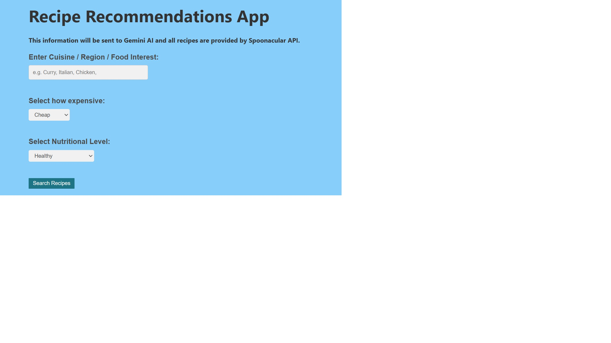
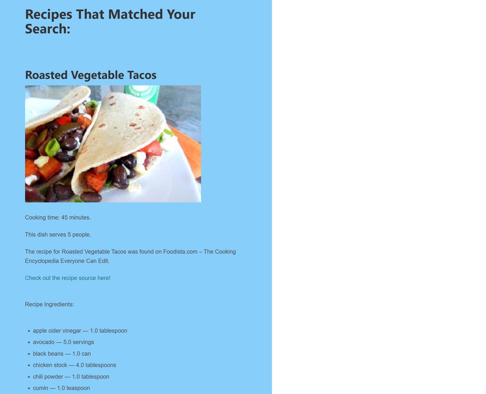
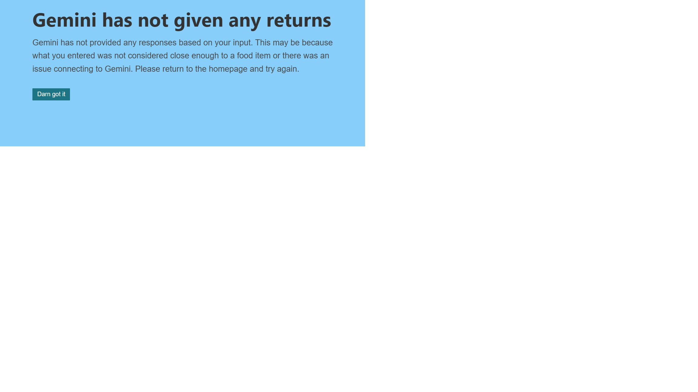

***This readme is a work in progress and may be ammended in the future***

Our app will ask the user for what type of food, how healthy and the cost of the food they would like.

The app will then query Gemini to find a list of strings containing 3-5 keywords each that will be used to find recipes
on Spoonacular.

Spoonacular will be searched using the query search to return a json response of recipe titles with an ID (containing other information as well).
These titles will be compared against the keywords returned by Gemini using TheFuzz to return the recipe that has the highest percentage match.

These recipes will be further processed to extract relevant information such as the recipe name, servings, cooking time and ingredients to be displayed
for the user. If no matches are found a different page will be displayed telling the user this and directing them to the homepage.

(For all examples add own apiKey)
Example of Spoonacular API return with titleMatch:
https://api.spoonacular.com/recipes/complexSearch?query=bolognese&apiKey=

Example of Spoonacular API return with Get Recipe Information:
https://api.spoonacular.com/recipes/634900/information?includeNutrition=false&apiKey=

The app needs a free version of the Spoonacular API Key saved as an environment variable as SPOONACULAR_KEY. And a Gemini API key saved as an environment variable as GEMINI_API_KEY. 
The app is expecting you to enter some kind of cuisine, food item, ingredient, country etc. in the first text box then select how healthy and affordable you would like the results to be. 
A successful execution will display two to three recipes including a picture, facts about the recipe, ingredient and instructions. 

If there are no results from the API another page will explain this to the user.

If Gemini could not return any results based on the users input a separate page will tell the user their response could not be processed. If the user uses more than 50 API 
calls a page will be displayed showing them a message that they must wait until the next day to use the app again.

(I ran out of time to get an image of no results found and I did not want to hit my API limit trying to get it.)

***A note on installing the dependency TheFuzz***
If you are having trouble getting your project to recognize TheFuzz as an import statement, make sure your interpreter is using the python.exe in your virtual environment
In this project it would be: venv/Scripts/python.exe